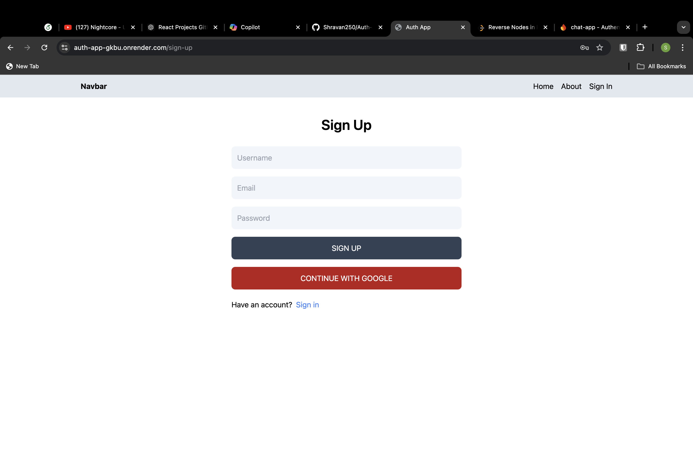
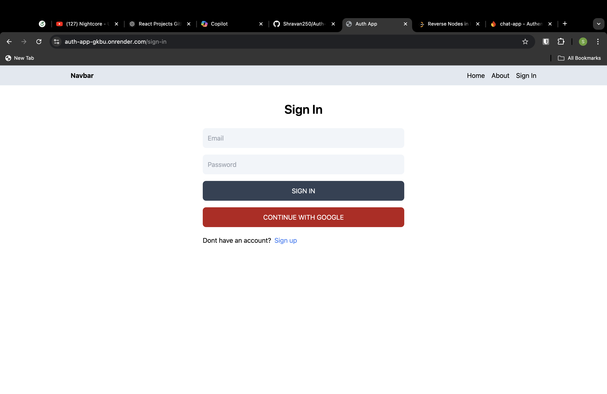
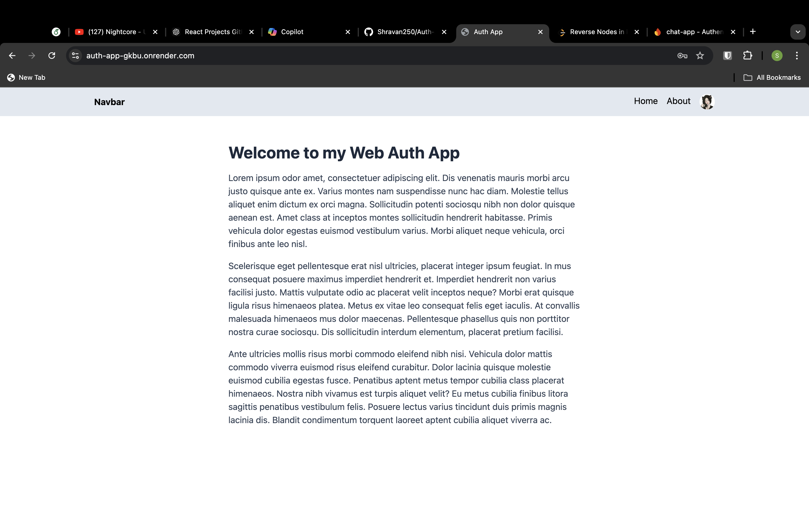
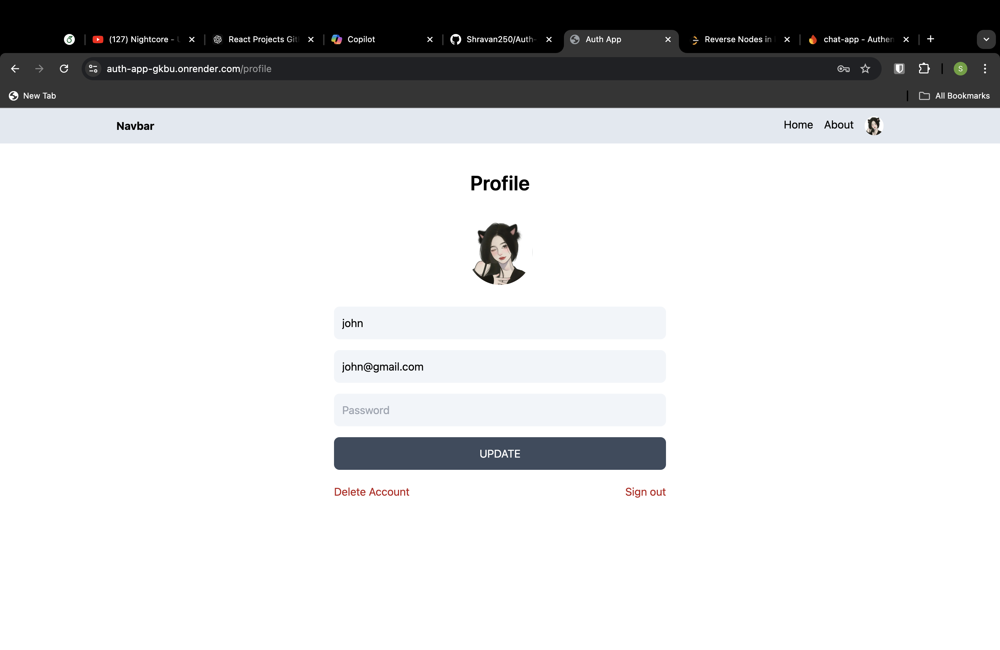

# Auth App

This is a simple authentication application built with **React**, **Firebase**, and **React Router**. The app allows users to sign in, register, and update their profile, featuring email-password-based authentication as well as Google OAuth for easy sign-in.

## Features

- **Email/Password Sign-In**: Users can sign in with their email and password.
- **Google OAuth Sign-In**: Option to sign in with Google for a streamlined login experience.
- **Profile Update**: Users can update their profile, including their avatar, name, and email.
- **Protected Routes**: Chat and profile pages are only accessible when authenticated.
- **Real-time User Status**: Tracks and updates the user's last seen status.
- **Responsive Design**: Ensures a clean and user-friendly interface on both desktop and mobile devices.

## Screenshots

1. **Sign Up Page**
   

2. **Login Page**
   

3. **Home Page**
   

4. **Profile Update Page**
   

## Tech Stack

- **React**: Frontend UI framework.
- **Firebase**: Used for authentication and google Auth.
- **MongoDB**: Used for Storing all the
- **React Router**: For navigation and route protection.
- **TailwindCSS**: Custom styles for a clean interface.

## Setup Instructions

1. **Clone the Repository:**

   ```bash
   git clone https://github.com/Shravan250/Auth-App.git
   cd Auth-App
   ```

2. **Install dependencies**:

   ```bash
   npm install
   ```

3. **Set Up Firebase**:

-Create a project on Firebase.
-Enable Authentication (Email/Password and Google OAuth).
-Create a Firestore database.
-Add your Firebase configuration details to a firebaseConfig.js file.

4. **Run the Application**:

   ```bash
   npm start
   ```

5. **Build for Production**:

   ```bash
   npm run build
   ```

## Firebase Configuration

Make sure to add your Firebase project configuration inside the firebaseConfig.js file:

   ```bash
    // firebaseConfig.js
    export const firebaseConfig = {
    apiKey: "YOUR_API_KEY",
    authDomain: "YOUR_PROJECT_ID.firebaseapp.com",
    projectId: "YOUR_PROJECT_ID",
    storageBucket: "YOUR_PROJECT_ID.appspot.com",
    messagingSenderId: "YOUR_MESSAGING_SENDER_ID",
    appId: "YOUR_APP_ID"
    };
   ```

## 🔄 Deployment

The app is currently deployed using Render. To deploy your own version, follow these steps:

1. Sign up on Render.
2. Link your GitHub repository.
3. Configure the build and deploy settings for a React app.

## 🤝 Contributing

Contributions are welcome! If you'd like to contribute:

1. Fork the repository.
2. Create a new branch.
3. Submit a pull request with your changes.

We appreciate any contributions that help make this project better!

## 📄 License

This project is licensed under the MIT License. Feel free to use and modify it as needed.

---
